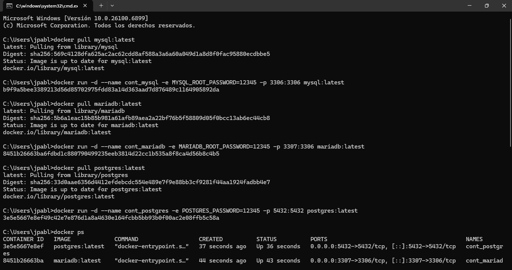
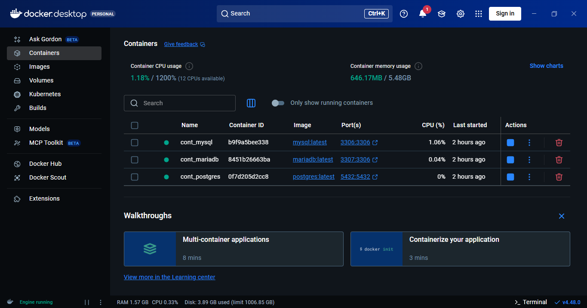

Inicio: Iniciamos descargando en caso de no tenerlo MySQL, MariaDB, PostgreSQL y Doker despues descargamos los clientes graficos DBeaver, HeidiSQL y Beekeeper Studio
Luego instalamos por medio de el CMD o Power shell los comandos que se ven en las capturas

despues lo verificamos

ahora entramos a doker y verificamos si se crearon

una vez echo solo es cuestion de entrar a los respectivos clientes graficos y los creamos

